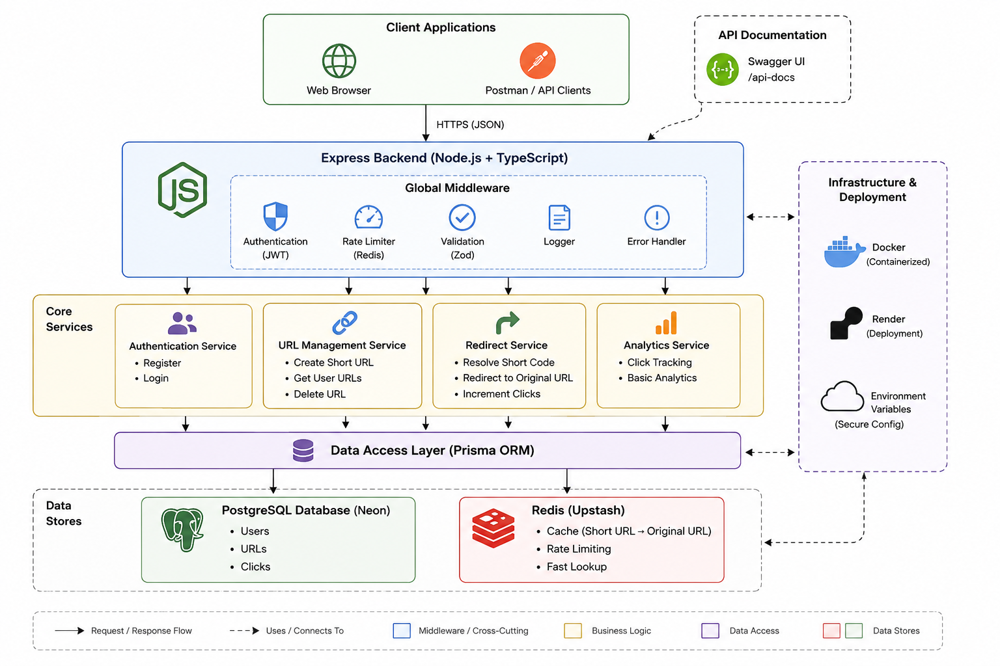

# URL Shortener API

A production-style URL shortening service built with Node.js, Express, PostgreSQL, Redis, Prisma, and Docker.

The project focuses on backend engineering fundamentals including authentication, caching, rate limiting, API documentation, containerization, and cloud deployment.

## Live API Docs

https://url-shortner-r77j.onrender.com/api-docs/

---

# Features

- JWT Authentication
- URL shortening
- Public redirect service
- Click analytics
- Redis caching
- Rate limiting
- Swagger/OpenAPI documentation
- Dockerized infrastructure
- PostgreSQL with Prisma ORM
- Structured error handling
- Zod validation
- Health check endpoint

---

# Tech Stack

## Backend
- Node.js
- Express
- TypeScript

## Database
- PostgreSQL
- Prisma ORM

## Caching & Infrastructure
- Redis
- Docker
- Docker Compose

## Validation & Documentation
- Zod
- Swagger/OpenAPI

## Deployment
- Render
- Neon PostgreSQL
- Upstash Redis

---

# Architecture



---

# API Endpoints

## Authentication

| Method | Endpoint | Description |
|---|---|---|
| POST | `/auth/register` | Register new user |
| POST | `/auth/login` | Login and receive JWT |

---

## URL Management

| Method | Endpoint | Description |
|---|---|---|
| POST | `/urls` | Create short URL |
| GET | `/urls` | Get all user URLs |
| GET | `/urls/:id` | Get URL by ID |
| DELETE | `/urls/:id` | Delete URL |

---

## Redirect

| Method | Endpoint | Description |
|---|---|---|
| GET | `/:shortCode` | Redirect to original URL |

---

## System

| Method | Endpoint | Description |
|---|---|---|
| GET | `/health` | Health check |
| GET | `/api-docs` | Swagger documentation |

---

# Example Request

## Create Short URL

```bash
curl -X POST \
  https://url-shortner-r77j.onrender.com/urls \
  -H "Authorization: Bearer YOUR_TOKEN" \
  -H "Content-Type: application/json" \
  -d '{
    "originalUrl": "https://google.com"
  }'
```

---

# Local Development

## Clone Repository

```bash
git clone <your-repo-url>
cd url-shortner
```

---

## Environment Variables

Create a `.env` file:

```env
DATABASE_URL=your_postgres_url
REDIS_URL=your_redis_url
JWT_SECRET=your_secret
PORT=5000
```

---

## Run With Docker

```bash
docker compose up --build
```

---

## Apply Prisma Migrations

```bash
npx prisma migrate dev
```

---

# Engineering Concepts Demonstrated

- REST API design
- JWT authentication flow
- Redis caching
- Cloud deployment
- Docker containerization
- ORM-based database access
- Middleware architecture
- Request validation
- Error handling
- Rate limiting
- Environment-based configuration

---

# Production Notes

- Redis used for caching and rate limiting
- PostgreSQL hosted on Neon
- Redis hosted on Upstash
- Backend deployed on Render
- Swagger configured for production deployment
- Containerized using Docker

---

# Future Improvements

- Custom aliases
- QR code generation
- Expiring URLs
- Background jobs
- User dashboard
- Advanced analytics
- CI/CD pipeline
- Unit & integration tests

---

